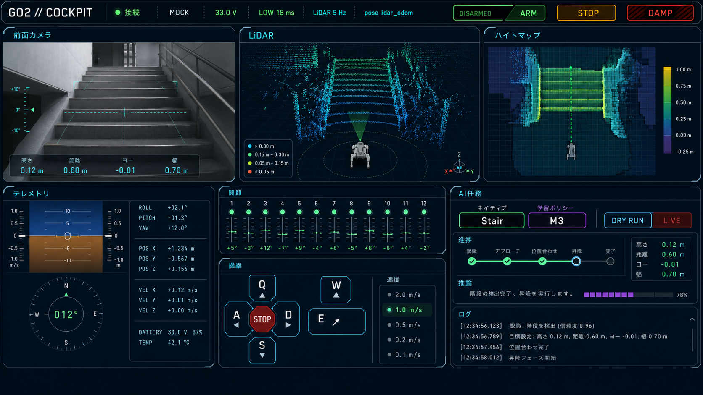
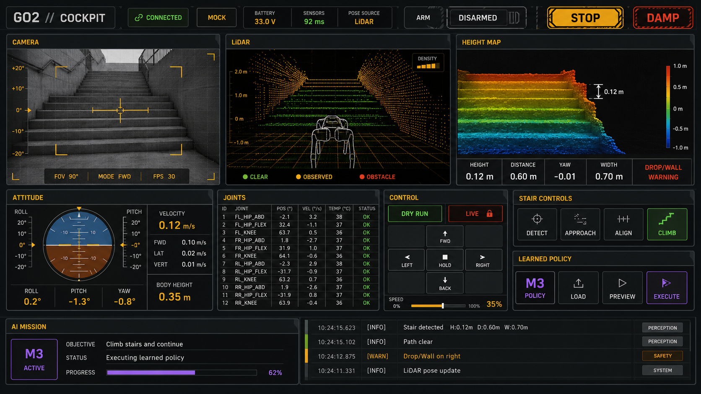
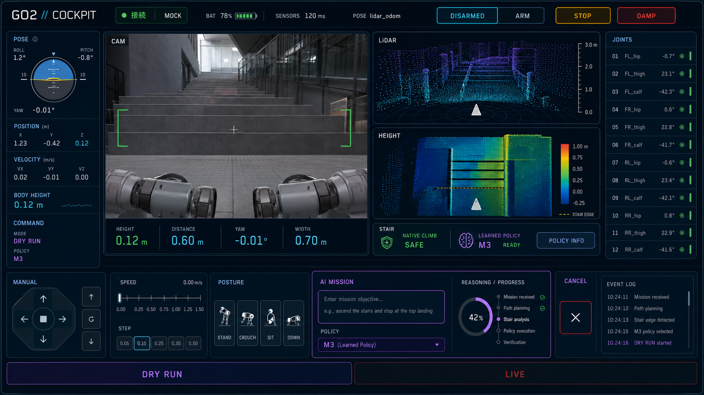

# GO2 Cockpit — SF UI concept study

This folder contains visual direction studies for the existing single-screen GO2
operator cockpit. They are concept images, not implementation screenshots.

## Existing UI contract retained

- Persistent connection, REAL/MOCK, sensor freshness, and ARM state
- Independent STOP and emergency DAMP actions
- Camera, LiDAR point cloud, and heightmap perception views
- Attitude, pose, command, and 12-joint telemetry
- Manual override controls and speed scale
- Native stair task versus learned-policy stair task
- Clear DRY RUN versus LIVE distinction
- Stair height, distance, yaw, width, and wall/drop warnings
- AI mission progress, reasoning, elapsed time, cancel action, and event log
- Semantic colors: green=safe, amber=warning, red=danger/LIVE,
  violet=learned policy

## Directions

### 01 — Orbital Cyan

Clean spacecraft command-deck aesthetic. Deep blue-black structure, cyan sensor
traces, restrained translucent panels, fine grid lines, and precise typography.
The three perception surfaces remain the visual focus.

### 02 — Tactical Amber

Rugged field-operations console. Matte graphite panels, amber instrumentation,
minimal glow, stronger mechanical framing, and a highly explicit safety hierarchy.

### 03 — Aurora Glass

Premium near-future robotics laboratory. Dark navy glass, cyan/violet holographic
layers, more breathing room, radial telemetry, a side joint rail, and a continuous
bottom mission deck.

## Generation notes

- Mode: built-in image generation
- Use case: `ui-mockup`
- Target: polished 16:9 desktop web application mockup, straight-on, no device frame
- Source: the current `cockpit/static/index.html`, `style.css`, and `app.js`
- The generated text is illustrative; production UI copy remains the source HTML.
