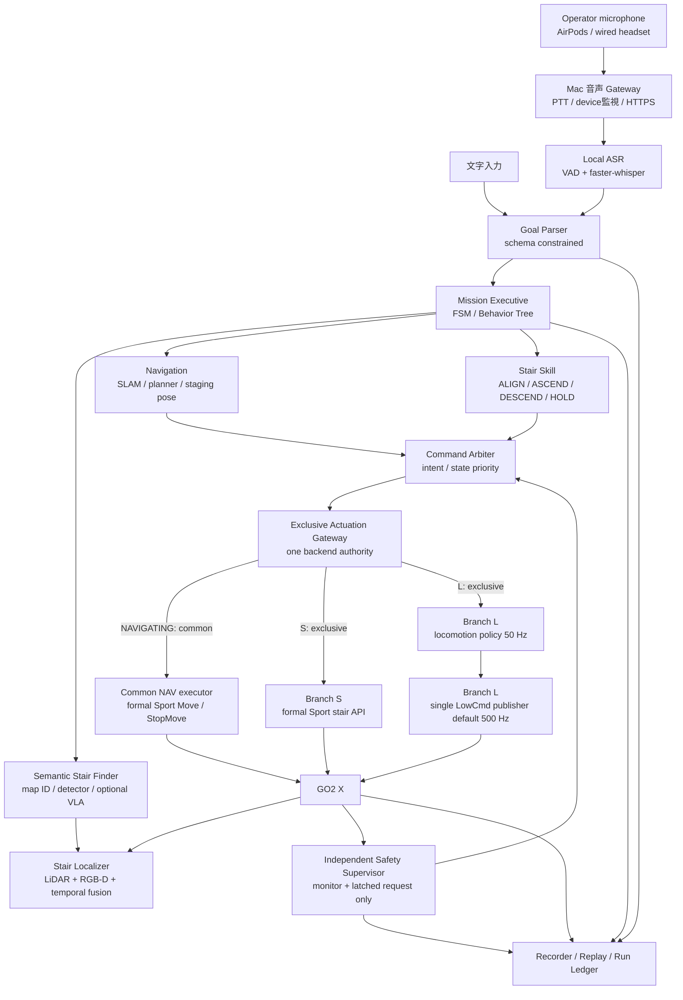
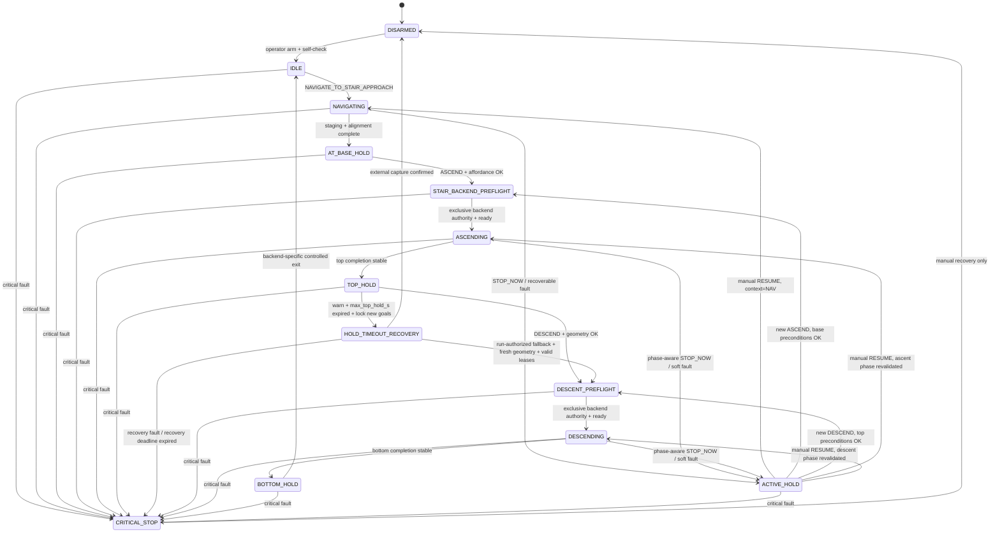

# 02. 目標アーキテクチャ

## 1. 設計結論

このプロジェクトでは、文字入力と音声入力を別々の制御系にしない。両方を同じ型付き命令へ正規化し、決定的な実行器が既存スキルだけを選ぶ。

```text
文字入力 ─────────────────┐
                          ├─> GoalSpec ─> 前提条件検証 ─> Mission Executive
選択マイク ─> ASR ─────────┘                                  │
                                                             ├─ NAVIGATE_TO_STAIR_APPROACH
                                                             ├─ ALIGN_TO_STAIR
                                                             ├─ ASCEND_STAIRS
                                                             ├─ DESCEND_STAIRS
                                                             └─ ACTIVE_HOLD
                                                                       │
                                                        Command Arbiter + Safety request
                                                                       │
                                                     Exclusive Actuation Gateway
                                                       ├─ NAV: common Sport navigation executor
                                                       ├─ Branch S: formal Sport stair API
                                                       └─ Branch L: policy → single LowCmd
```

LLM、VLM、VLA が出してよいものは、対象、意図、waypoint 候補、既存 skill 名までである。関節角、トルク、任意 Python、DDS command を直接生成・送信してはならない。

階段歩容は、最初に Go2 X の純正歩容を正式 API から利用できるか評価する。使えて性能が足りれば純正歩容を `ASCEND/DESCEND` skill として包み、足りない場合だけ Wave5 または再学習した LowCmd policy に置き換える。Mission 層から見た契約は同じに保つ。

## 2. システム全体



`NAVIGATING` では S/L の選択にかかわらず common Sport navigation executor を使う。stagingで `StopMove`、静止、姿勢、Sport状態を確認して `AT_BASE_HOLD` に入り、そこで階段用のmode generationへ切り替える。Branch S は navigation callを終了してformal Sport stair APIへ進む。Branch L は **Sport inactive ackを受信してから** LowCmd authorityを取得し、policyと単一 `LowCmd publisher` を起動する。ackなしの時限切替や両経路の同時送信は禁止する。

`Exclusive Actuation Gateway` は一度に一つの backend authority だけを有効にする。Branch S は正式に確認した Sport 階段 API だけを呼び、Branch L は policy と単一 `LowCmd publisher` だけを使う。`Safety Supervisor` は VLM/ASR/GPU process とは別に監視するが、robot command を publish せず、latched safe-state request を Command Arbiter/Gateway へ渡す。Branch L の最終 `LowCmd publisher` も GPU process から分離する。GPU OOM、ASR hang、UI 切断が選択 backend の deadline を破らない構造にする。

## 3. 配置とネットワーク

### 3.1 研究デモ時

```text
AirPods --------Bluetooth-------┐
USB/USB-C wired headset --------┼--> Mac/PWA
3.5 mm headset --対応jack/adapter┘       |
                                     HTTPS/WSS
                                          v
RTX 5090 Ubuntu workstation
  - ASR / semantic perception / mapping / Mission Executive
  - Branch S: formal Sport stair API adapter / API timeout / authority heartbeat
  - Branch L only: optional 50 Hz policy + single LowCmd publisher（default 500 Hz、200〜500 Hz候補はtiming gate後）
  - independent Safety Supervisor（監視とsafe-state requestのみ、DDS writerではない）
  - NIC A: operator network
  - NIC B: dedicated GO2 192.168.123.0/24
                         |
                 overhead-supported Ethernet
                         v
                       GO2 X
```

初期の係留試験では、有線の低遅延性を使える。ただし Ethernet 自体が転倒・引っ掛かり hazard なので、頭上支持、ストレインリリーフ、可動域制限が必要である。

### 3.2 最終デモ時

Branch L では、無線の jitter や workstation 障害から低レベル制御を切り離すため、50 Hz policy、既定500 Hzの単一publisher、watchdog を Unitree が認める onboard/companion compute へ移す。200〜500 Hzの代替候補は`T=1/f_tx`のtiming gateとhazard review後だけ選ぶ。Branch S では Gateway が正式 Sport API の authority、応答、timeout を監視し、姿勢維持を含む firmware/API 契約から外れた挙動を推測で補わない。どちらの branch でも Safety Supervisor は publisher を兼ねない。5090 は学習、重い知覚、ASR に使う。Go2 X で追加計算機や LowCmd が正式対応しない場合は、販売店/Unitree の確認後に EDU への移行を判断する。

GO2 の DDS subnet を通常 LAN へ bridge しない。IP forwarding/NAT を無効化し、CycloneDDS の interface を専用 NIC に固定する。Cockpit は TLS、認証、単一 operator lease を持たせる。

## 4. 共通命令 `GoalSpec`

### 4.1 schema

```json
{
  "schema_version": "1.0",
  "goal_id": "uuid",
  "source": {
    "modality": "TEXT | VOICE | UI | MANUAL",
    "operator_lease_id": "uuid",
    "session_id": "uuid",
    "utterance_id": "uuid-or-null"
  },
  "transcript": {
    "text": "その階段を登って一番上で止まれ",
    "language": "ja",
    "model_id": "text-parser-or-asr-model-id"
  },
  "intent": "NAVIGATE_TO_STAIR_APPROACH | ASCEND_STAIRS | DESCEND_STAIRS | STOP_NOW",
  "target": {
    "type": "stairs",
    "ref": "current | nearest | stair_id",
    "resolved_id": "stair-id-or-null"
  },
  "completion": {
    "predicate": "STAIR_APPROACH_POSE_REACHED | TOP_LANDING_STABLE | BOTTOM_LANDING_STABLE | IMMEDIATE",
    "terminal_action": "ACTIVE_HOLD",
    "dwell_s": 1.0
  },
  "constraints": {
    "max_speed_mps": 0.25,
    "require_geometry_confirmation": true
  },
  "confidence": {
    "semantic_score": 0.98,
    "context_score": 1.0,
    "parser_version": "intent-ja-v1"
  },
  "confirmation": {
    "required": true,
    "status": "CONFIRMED | NOT_REQUIRED",
    "proposal_id": "uuid-or-null",
    "challenge_id": "uuid-or-null"
  },
  "preconditions": ["ROBOT_ARMED", "ACTIVE_STAIR_GEOMETRY_VALID"],
  "created_at_utc": "2026-07-13T00:00:00Z",
  "expires_after_ms": 5000
}
```

これを本プロジェクトの canonical schema とする。`06_VOICE_AIRPODS.md` の音声 envelope も同じ field/enum を使い、音声固有の evidence は `transcript` または別の監査 metadata に追加する。自由文はこの schema を通過しなければ捨てる。JSON として正しくても、Mission state と affordance validator が実行可否を決める。`goal_id` と `utterance_id` により再送を重複実行しない。`created_at_utc` は監査用で、受理後の expiry/watchdog は server が記録した monotonic time で判定する。

復唱確認待ちのデータは実行可能な `GoalSpec` ではなく `GoalProposal` とする。ASR/parserは `proposal_id` と一回限りの `challenge_id` を持つ提案を発行し、初期30秒の確認TTLを与える。確認messageは両IDを参照する。serverはoperator lease、robot state、stair geometryを再検証した後、新しい `goal_id` の `CONFIRMED` GoalSpecを発行し、そこから5秒の**開始可能期限** `must_start_by` をmonotonic clockで数える。これは数十秒のnavigation/昇降を5秒で打ち切るexecution timeoutではない。開始後はskill別mission timeout、owner lease、低位CommandEnvelope deadlineを別に監視する。`STOP_NOW` はproposal/確認を迂回して `NOT_REQUIRED` とする。

### 4.2 要求文の正規化

| 入力 | 正規化結果 |
|---|---|
| 「階段の前まで行け」 | `NAVIGATE_TO_STAIR_APPROACH`, `stairs/current-or-nearest`, `STAIR_APPROACH_POSE_REACHED`, `ACTIVE_HOLD` |
| 「その前の階段を登って一番上まで行ったら止まれ」 | `ASCEND_STAIRS`, `current`, `TOP_LANDING_STABLE`, `ACTIVE_HOLD` |
| 「降りて段を下り切ったらまた止まれ」 | `DESCEND_STAIRS`, `current`, `BOTTOM_LANDING_STABLE`, `ACTIVE_HOLD` |
| 「止まれ」「今すぐ止まって」 | `STOP_NOW`, `IMMEDIATE`, `ACTIVE_HOLD` |
| 「力を抜け」 | 通常の語彙には含めず、物理的な安全操作と権限付き UI に限定 |

複合文の末尾にある「止まれ」は completion 条件であり、独立命令の `STOP_NOW` ではない。現行 parser の最優先 substring 判定を、全文の構造解析と限定 grammar に置き換える。

### 4.3 前提条件

| skill | 必須条件 |
|---|---|
| `NAVIGATE_TO_STAIR_APPROACH` | localization 有効、collision map fresh、stair candidate が存在、低 battery/critical fault なし |
| `ASCEND_STAIRS` | `AT_BASE_HOLD`、上り方向、幾何が backend の検証済み envelope 内、staging 誤差内、着地点 coverage 有効 |
| `STAIR_BACKEND_PREFLIGHT` | arm前manifestで選択済みのS/Lを再検証、formal APIまたはLowCmd capability確認、exclusive backend authority取得可能、上昇＋`max_top_hold_s`＋事前選択recoveryを完遂できるenergy reserve。ここでbackendを変更しない |
| `DESCEND_STAIRS` | `TOP_HOLD`、下降階段を再取得、下降方式が決定済み、下側 landing が観測済み、rear/down view 有効、選択 backend の下降 capability と reserve 有効 |
| `CONTROLLED_EXIT` | 十分広く平坦な landing、全脚が edge から離れ、静止継続済み |

`max_top_hold_s=60` は初期試験の候補値であり、client/LLM が変更できる `GoalSpec` field にはしない。server-side signed run safety config/manifest に固定し、実測した消費電力、温度、landing 条件から短くすることはあっても無期限にはしない。同じconfigに有限の`recovery_deadline_s`も持たせる。timeout recoveryもarm前の署名済みmanifestで選択し、preflightでは一致、readiness、完了までのenergy reserve、人員・fall restraint、leasesを再検証するだけである。既定は `EXTERNAL_CAPTURE_AT_TOP` とする。`VALIDATED_CONTROLLED_DESCENT` は、run前に別項目として明示承認され、実行時にもgeometry再検証とoperator/safety lease確認を通る場合だけ選べる。どの recovery も成立しない場合は上昇を開始しない。その他の条件不成立時も「推測して実行」せず、拒否理由を返して `ACTIVE_HOLD` を維持する。

## 5. Mission state machine



`ACTIVE_HOLD` は `resume_context`、stair ID、gait phase、選択 backend を保存する。自動再開はせず、状態に対応した前提条件を再検証して元の経路へ戻す。`TOP_HOLD` では選択 backend の active-balance authority を保持する。Branch S は正式 API で検証した balance/hold 契約を使い、Branch L は policy の `v=(0,0,0)` target を単一 LowCmd publisher が送り続ける。階段上で S/L を切り替えない。

`TOP_HOLD` は完了状態ではなく、signed run safety config の `max_top_hold_s` 付き待機状態である。期限前に警告し、期限到達時は新規goalを禁止して `HOLD_TIMEOUT_RECOVERY` に入る。既定は人がfall restraintで `EXTERNAL_CAPTURE_AT_TOP` を明示完了してから `DISARMED` にする経路であり、捕捉自体にも有限の`recovery_deadline_s`を課す。下降fallbackは、run前に独立して明示承認された場合に限り、その時点で階段geometryを再検証し、operator leaseとsafety leaseの両方が有効なら `DESCENT_PREFLIGHT` へ進める。一条件でも欠ければ下降しない。音声確認なしのblind fallback、新しい自然言語判断、未検証の自動行動を timeout 時に生成しない。

## 6. Navigation と階段候補

### 6.1 MVP: 既知の試験区画

最初は SLAM map に `stair_id`, base pose, top pose, forbidden zone を登録する。文字命令は semantic landmark を引き、planner が階段そのものではなく 0.5〜0.8 m 手前の staging pose を目標にする。最後の 0.35〜0.50 m は Stair Localizer と専用 align controller が低速で詰める。

SportClient または動作確認済みの `ObstaclesAvoidClient` を velocity executor として利用できる。後者の Go2 X/firmware 対応は Phase 0 で確認する。Nav2 を採用する場合も、階段を通常の traversable costmap として無理に通さず、平地 navigation と stair skill の境界を明示する。

### 6.2 拡張: 未知環境

VLM/NaVILA は画像と言語から階段候補や中間 waypoint を提案するだけにする。その出力を planner が collision check し、最終 1 m は LiDAR/RGB-D の `StairModel` が幾何を検証する。

```text
VLA candidate != executable stair
geometry-confirmed StairModel + safe approach pose == executable candidate
```

階段が見つからない、複数あって参照が曖昧、geometry confidence が不足する場合は質問または停止に戻る。

## 7. StairModel と locomotion 契約

```text
StairModel
  id, frame_id, timestamp, covariance
  terrain_class: STAIRS | DROP | WALL | UNKNOWN
  direction: UP | DOWN | UNKNOWN  # terrain_class=STAIRS のときだけ有効
  pose, yaw, width
  riser_height[], tread_depth[]
  step_count, top_plane, bottom_plane
  visible_region, unknown_mask, cell_age
  confidence, training_envelope_match
```

Stair Localizer は camera の意味認識だけで許可を出さない。LiDAR/RGB-D で床、段鼻、踏面、上下方向を時系列融合し、`unknown != flat` を保つ。

Locomotion skill の入力は次に限定する。

```text
LocomotionCommand
  backend: SPORT_STAIR_API | LEARNED_LOWCMD
  mode: ASCEND | DESCEND_BACKWARD | DESCEND_FORWARD | HOLD
  local_goal: x, y, yaw, z
  velocity_hint: vx, vy, wz
  stair_geometry_summary
  perception_confidence
  command_deadline
```

Branch S の出力は formal Sport stair API の型付き request/result と authority/timeout diagnostics であり、Mission は joint target を作らない。Branch L の出力は policy の12関節 target と diagnostics で、Exclusive Actuation Gateway 配下の単一 LowCmd publisher だけが送信する。同じ `LocomotionCommand` を両branchに二重配送しない。backendはarm前のsigned run manifestで固定し、`STAIR_BACKEND_PREFLIGHT`では一致・readinessを再検証してauthorityをactivateするだけである。

## 8. 制御周期と process 境界

| 層 | 目安周期 | deadline/fallback |
|---|---:|---|
| LLM/VLA/ASR | event、0.2〜2 Hz 相当 | timeout は命令不成立。既存動作を勝手に延長しない |
| Mission Executive | 10〜20 Hz | state heartbeat staleで新規goal禁止、phase別safe boundary |
| SLAM/elevation/StairModel | 10〜20 Hz | cell age と landing coverage を必ず伝える |
| local navigation | 20〜50 Hz | command expiry、collision stop |
| common Sport navigation executor | 20〜50 Hz command更新 | `Move/StopMove`のformal API状態を監視し、stagingで停止確認。Branch L移行時はinactive ack必須 |
| Exclusive Actuation Gateway | 50〜100 Hz authority heartbeat＋event | common NAV/S/Lのmodeを排他的に選択し、selected backend の deadline/response を監視 |
| Branch S: formal Sport stair adapter | API event＋documented firmware cycle | formal API の応答timeout、authority、状態遷移を監視。LowCmdをpublishしない |
| Branch L: locomotion policy | 50 Hz | inference target staleでactuator serverのphase別fault policy |
| Branch L: single LowCmd publisher | 既定500 Hz。200〜500 Hz候補 | 最新50 Hz targetをZOH再送。代替rateは`T=1/f_tx`のjitter gate、signed config、hazard review後のみ |
| Safety Supervisor | 100 Hz 以上＋独立 watchdog | critical faultを監視しlatched safe-state requestをGatewayへ送る。robot command/DDSはpublishしない |

以下は Branch L にだけ適用する。公式 Go2 stand example は LowCmd を 2 ms 間隔で送り、例示範囲を 1〜10 ms としている。したがって、現行 Python 50 Hz loop のまま実機投入せず、50 Hz policy と高周期の単一 publisher を分離して firmware ごとに deadline と挙動を検証する。高周期化は同じ target を再送する ZOH を既定とする。target 間を補間すると学習時の action contract を変えるため、補間を使う場合は学習環境、MuJoCo、実機の三者で同じ filter を実装して比較合格した場合に限る。Branch S の周期と timeout は formal Sport stair API の明文化された契約と実機 fault injection から決め、LowCmd の周期を流用しない。

## 9. command ownership と停止意味論

command arbiter の優先順位を一か所に固定する。

```text
physical safety action
  > independent Safety Supervisor
  > STOP_NOW / authenticated manual override
  > active stair skill
  > navigation controller
  > language/VLA proposal
```

robot actuation の backend authority は一つだけである。Gateway は common NAV Sport authority、Branch S stair Sport authority、Branch L LowCmd authorityのうち一つだけを有効にし、Sport serviceとLowCmdを並行送信しない。NAV Sport authorityとrun開始時に選んだstair backendの切替はstaging／安全な平坦landingのtransactionで行い、Branch LはSport inactive ack後だけLowCmdを取得する。`selected_backend`はrun中不変とし、S↔Lを変更するときはcontrolled exit後にrunを終了し、新しいmanifestと`run_id`でre-armする。Safety Supervisorが「ownerを奪う」とは論理的な最優先stateを要求する意味で、API clientやDDS writerを競合起動する意味ではない。Gateway は Branch S なら formal API で検証済みの hold/stop/recovery を呼び、Branch L なら sole LowCmd actuator serverへ安全frameを要求する。selected backend 自身が死んだ場合は自動software takeoverに頼らず、実測済み firmware/API timeout と独立停止経路が bounded safe response を持たなければ階段LIVEをNo-Goとする。

| 操作 | Branch S: formal Sport stair API | Branch L: learned LowCmd | 使用場面 |
|---|---|---|---|
| `ACTIVE_HOLD` | 検証済みのformal balance/hold APIを呼び、Sport authorityを保持 | `v=(0,0,0)`のpolicy targetをsole publisherが継続 | 音声 stop、上端/下端完了、recoverable fault。ただし`TOP_HOLD`は`max_top_hold_s`まで |
| `StopMove` | 平地Sport navigationの移動停止。階段中はformal APIが明示的に保証しない限り代用しない | 使用しない。LowCmd ownerと競合させない | 主に平地navigation中 |
| `CONTROLLED_EXIT` | 既にSport authorityなら検証済みstand/idle遷移 | 平坦landingでLowCmdを終了し、release後にSport authorityを取得 | 安全なlanding上のみ |
| `DAMP/CRITICAL_STOP` | formal emergency contractがある場合だけGatewayから要求 | sole publisherから検証済みcritical frameを送る | 姿勢破綻、command corruption等。落下防止設備前提 |
| physical E-stop function | 検証済みの独立hardware/systemとしてのみ扱う | 検証済みの独立hardware/systemとしてのみ扱う | critical motion停止。搭載済みと仮定せず、音声で代替しない |
| fall restraint / external capture | 転落捕捉と上端回収を行う | 転落捕捉と上端回収を行う | 転倒・落下の被害軽減。E-stop機能ではない |

`Damp` は階段上で安全に立ち続ける命令ではない。どの fault で hold、sit、Damp、外部捕捉のどれを選ぶかは、実機 fault injection で検証し、単一の「停止」関数へ潰さない。

## 10. 実装モジュール案

既存コードを保ち、次の境界を追加する。

```text
contracts/
  goal_spec.py
  stair_model.py
  command_envelope.py
mission/
  executive.py
  affordance_validator.py
  command_arbiter.py
navigation/
  semantic_landmarks.py
  stair_approach.py
perception/
  stair_localizer.py
  map_freshness.py
locomotion/
  stair_skill.py
  sport_backend.py
  policy_backend.py
realtime/
  exclusive_actuation_gateway.py
  lowcmd_servo/          # Branch L only, C++ candidate, sole DDS writer
safety/
  supervisor.py          # monitor + latched request; not a publisher
  fault_policy.yaml
voice_gateway/
  protocol.py
recording/
  run_manifest.py
  replay.py
```

最初に interface contract と replay test を作り、その後 backend を置換する。これにより、純正歩容、Wave5、再学習 policy を Mission/音声側の変更なしで比較できる。

## 11. 守るべき invariant

1. Language model は proposal を出すだけで、actuator owner にならない。
2. `unknown`、stale、low-confidence は free space と同義にしない。
3. 上りと下り、正常 HOLD と critical Damp を別の状態・KPI にする。
4. Sport と LowCmd の command owner は排他的である。
5. Common Sport navigation から階段 backend への切替は staging transaction とし、Branch L は Sport inactive ack 前に LowCmd を開始しない。
6. GPU process や network が止まっても Gateway、selected backend timeout、local safety loop は期限内に動く。
7. 全 action は command ID、state snapshot、model hash、sensor freshness と結び付けて記録する。
8. 実機で未確認の firmware/API 能力を前提にしない。

この invariant を保つ限り、将来 VLA や world model を追加しても安全クリティカル層を作り直さずに済む。
