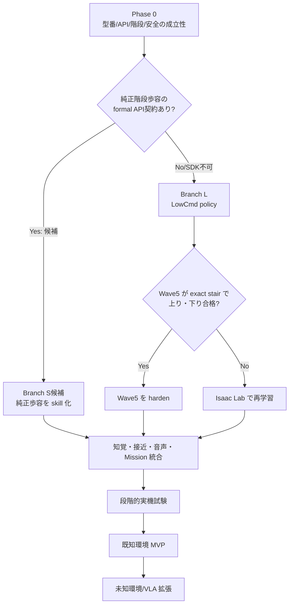

# 04. 実装ロードマップ

## 1. 全体方針

最短経路は、「最初から新しい VLA や RL を作る」ことではない。実機能力と既存 Wave5 を先に測り、結果で分岐する。

純正歩容採用でも、安全監視、階段認識、完了判定、音声、navigation は必要である。逆に LowCmd が必要でも、Mission/GoalSpec は変更しない。

## 2. 期間の見積もり

経験者 2 名程度で並列化できる場合の目安:

- 純正歩容が正式 API から使え、固定階段で合格: **10〜16 週間**で監視下の既知環境 MVP。
- Wave5 の hardening が必要: **14〜22 週間**。
- perception-conditioned policy の再学習と実機移行が必要: **20〜36 週間**。
- 未知環境での階段探索/VLA を含む: 上記 MVP 後に **追加 8〜16 週間**。

一人でハードウェア、ROS、RL、音声、試験設備を担当する場合は 8〜14 か月を現実的な幅とする。期間は安全ゲートを省略して縮めない。

## 3. フェーズ別計画

### Phase 0: 成立性・安全ゲート

期間: 1〜2 週間  
目的: 大きな実装投資の前に、ハードウェア/API/物理形状の分岐を確定する。

作業:

1. 本体の SKU が Go2 X であることを serial、firmware とともに実機で確定する。
2. Unitree/販売店へ次を正式確認する。
   - X での `LowCmd` と `MotionSwitcherClient.ReleaseMode()` の可否
   - 保証条件
   - 純正階段歩容を外部 SDK から開始する正式 API
   - `ObstaclesAvoidClient` の対応
   - Low-level mode 中の LiDAR、`robot_odom`、remote input、`foot_force` の意味
3. 階段の段高、踏面、幅、摩擦、edge 丸み、上端/下端 landing を実測し、stair ID を付ける。
4. 上端で約 1 m の旋回面を作れるか確認し、前向き下降か後退下降かを決める。
5. 安全索、支持フレーム、マット、立入禁止域、監視者を用意する。Unitree/販売店と安全担当者により独立停止候補を同定し、リモコンDamp・電源断を未検証のままE-stopと呼ばない。
6. 純正リモコン階段モードの存在、選択方法、対象方向、正式APIの有無を、取扱資料・販売店回答と、吊り下げ／平地での表示・telemetryから確認する。独立停止とfirmware timeoutをまだ実証していないPhase 0では、段差へ接地させない。
7. `ReleaseMode()` 前後で必要 topic の有無、rate、latency、jitter を記録する。
8. LowCmd はまず吊り下げで、command ownership、remote emergency input、stale command 挙動を確認する。

成果物:

- `hardware_manifest.yaml`: SKU、serial、firmware、LiDAR、compute、battery。
- `stair_registry.yaml`: 実寸、写真、座標系、摩擦条件、landing。
- `api_gate_report.md`: 各 API/topic の実測結果。
- safety test setup の写真と checklist。

Go/No-Go:

- SDK 権限または安全な command owner 切替が確認できなければ、LowCmd branch は停止する。
- LowCmd owner死亡時を含む独立停止/firmware timeoutのbounded responseを定義できなければ、階段LIVEへ進まない。
- top landing が不足するなら、180°旋回を仕様から外し、rear/down sensor を用いた後退下降を採用する。
- 純正歩容を正式APIから開始できる見込みが確認できれば Branch Sを候補として残す。段差への初回接地screeningとexact staircaseの各30回評価は、Phase 1の安全基盤とPhase 4の知覚を通した後、Phase 6/7の試験ladderで行う。

### Phase 1: 制御と安全の土台

期間: 1〜2 週間  
依存: Phase 0 の API gate。

作業:

- `HOLD`, `StopMove`, `CONTROLLED_EXIT`, `DAMP` を別 API/状態にする。
- 頂上到達時の SIGINT→Damp を廃止し、選択backendが能動balanceを維持するterminal stateを実装する。
- 共通のcommand arbiter、exclusive actuation gateway、単一owner lease、mode generationを実装する。
- LowState、選択backendのcommand/ack/heartbeat、roll/pitch、joint、temperature、battery、networkのwatchdogを独立processにする。
- **Branch L**: 50 Hz policy inferenceと既定500 Hzのsingle-owner LowCmd publisherを別processにし、Sport→LowCmd→Sport transactionを吊り下げ／平地で試す。200〜500 Hzの代替rateは`T=1/f_tx`のtiming gateとhazard review後だけ採る。
- **Branch S**: formal stair APIだけを通すexclusive Sport gatewayを作り、stair start/state/complete、`StopMove`、Damp、timeout、remote overrideを吊り下げ／平地で試す。通常の`Move()`を階段skillとして代用しない。
- UI/voice/VLM が落ちても安全 process が継続する fault-injection test を作る。

成果物:

- `CommandEnvelope`, owner lease, supervisor event schema。
- 平地でterminal active balanceを10分維持し、thermal/voltage/deadlineまたはAPI timeout violationがないログ。
- Branch Lはprocess kill、packet loss、stale target、TX timingの試験結果。Branch Sはgateway/service kill、API timeout、StopMove no-ack、remote override競合の試験結果。

Go/No-Go:

- Branch Lの二重publisher／期限切れtarget継続、Branch Sの複数Sport command経路／未定義timeout、または監視processと同時停止が1件でも残れば階段試験へ進まない。

### Phase 2: データ・較正・replay 基盤

期間: 1〜2 週間。Phase 1 と一部並列可能。

作業:

- 点群、画像、IMU、joint、command、odom、FSM、安全イベントを同一 monotonic timeline で MCAP/rosbag に記録する。
- LiDAR/camera/body の外部パラメータと time offset を較正する。
- `cloud_deskewed` と `robot_odom` 依存を明示し、失われた場合の Point-LIO/VIO fallback を評価する。
- raw log から elevation map、StairModel、GoalSpec、completion detector を再生できる offline runner を作る。
- firmware、git commit、model hash、calibration hash を run manifest に固定する。
- LingBot-Map 等の camera-derived visual map は、この記録基盤で offline 評価してから採否を決める。個別 gate は [10_LINGBOT_MAP_INTEGRATION_ASSESSMENT.md](10_LINGBOT_MAP_INTEGRATION_ASSESSMENT.md) を参照し、Phase 2 の既定成果物には live 統合を含めない。

成果物:

- 平地、上り候補、下り edge、negative scene の代表 dataset。
- deterministic replay test と golden outputs。
- sensor freshness/coverage dashboard。

Go/No-Go:

- センサ間時刻ずれと frame transform が許容値内でない、または run を再生できない状態で perception/RL の性能値を出さない。

### Phase 3: 共通 GoalSpec と音声入力（有線／AirPods）

期間: 1〜2 週間。Phase 1〜2 と並列可能。

作業:

- 文字、UI、USB/USB-C有線マイク付きイヤホン、AirPods を `GoalSpec` へ統一する。
- 現行 substring parser を、限定 grammar＋schema validator＋state precondition に置き換える。
- 選択マイク→Mac gateway を HTTPS/WSS または native companion として実装する。
- device ID、input level、track終了、USB/cable切断、Bluetooth disconnect、duplicate command を監視する。
- MVPの基準入力をUSB/USB-C有線マイク付きイヤホンとし、AirPodsは同じdevice abstractionを通る無線variationとして比較する。3.5 mm品はMac/adapterが入力deviceとして認識する場合だけ候補にする。
- 5090 で local faster-whisper を benchmark し、日本語/騒音 corpus により model/quantization を選ぶ。
- PTT を初期仕様とし、危険な動作は復唱確認、`STOP_NOW` は確認なしとする。

成果物:

- ユーザーの 3 つの要求文を正しく parse する unit test。
- 1000 以上の paraphrase/negative utterance corpus。
- 選択マイクの抜去／消失、AirPods切断、無音、二重送信、ASR timeout の test。

Go/No-Go:

- safety-critical parser suite は 100%。非命令音声からの危険 skill 起動は 0 件。音声だけを E-stop として扱わない。

### Phase 4: 双方向 StairModel、既知地図 navigation、接近

期間: 3〜6 週間  
依存: offline/replay開発はPhase 2。実機を動かすstaging試験はPhase 1と `08_SAFETY_TEST_EVALUATION.md` Gate 3の合格後。

作業:

- 試験区画のmapを作り、relocalization/reset/recoveryを含むSLAM/localizationを固定する。
- stair semantic landmark、base/top pose、keep-out/drop zoneをmapへ登録する。
- Nav2等のglobal/local planner、costmap、collision/drop guardianを構成し、階段そのものではなく0.5〜0.8 m手前のstaging poseをgoalにする。
- plannerのbounded velocityを、実機で確認したSport/`ObstaclesAvoidClient` executorへ渡す。この実機項目はPhase 1＋Gate 3合格後に行い、VLMのopen-loop `move/turn`を主経路にしない。
- elevation cell に `known/unknown`, timestamp, variance を保持する。
- 0.5〜1.0 秒の点群を自己位置補償して統合する。
- floor、平行な段鼻、踏面、蹴上、上端/下端 landing を RANSAC/モデル fitting する。
- `terrain_class: STAIRS | DROP | WALL | UNKNOWN` と、階段の場合の `direction: UP | DOWN | UNKNOWN` を分離する。
- RGB/VLMはROI/意味候補に使い、失敗を `climbable=true` へ変換しない。VLMをrequired sensorにしたrunだけtimeoutをNo-Goにし、既知階段でadvisoryなら幾何＋独立guardianで判定する。
- map 上の stair semantic waypoint と 0.5〜0.8 m staging pose を実装する。
- 最終 0.35〜0.50 m の低速 align controller を実装する。
- landing footprint ごとの freshness/coverage gate を作る。
- planner failure、localization loss、stair候補消失、動的障害物でblind retryせず、停止/再計画/拒否するrecoveryを実装する。
- SLAM/localization provider の候補として LingBot-Map を扱う場合も、最初は read-only shadow mode とし、単眼 scale、drift、reset、LiDAR alignment の gate を通るまで navigation/control source にしない。

成果物:

- `StairModel` と covariance。
- 上り/下り/崖/平地/棚を含む replay benchmark。
- map/localization/costmap/guardianの設定とreplay。
- 1〜5 mの複数start poseからstaging poseへ到達する実機平地試験。
- 外部mocap/AprilTag/測量治具等によるground-truth report。評価対象のLiDAR/LIOを自身の正解に使わない。

開発entry gateの初期値:

- 10 cm 段高 MAE ≤ 1.5 cm。
- stair yaw error p95 ≤ 3°。
- staging position p95 ≤ 5 cm、yaw p95 ≤ 3°。
- 上下方向の safety-critical test set で誤方向 0 件。
- 次の足置き/landing footprint の fresh coverage ≥ 90%。
- navigation 30 run中29以上でstaging到達、edge crossing/階段接触/人・物とのcollision 0。
- localization/VLM/plannerのstallやdrop提示で、local guardianが停止距離内に止める。

最終acceptance KPIは `08_SAFETY_TEST_EVALUATION.md` をcanonicalとし、entry gateより緩めない。

### Phase 5: locomotion backend 候補のentry qualification

期間: 1〜2 週間（既存 policy 評価）、再学習なら追加 4〜8 週間。  
依存: Phase 0〜2。Phase 4 と並列で sim を進められる。

ここで行うのはPhase 6/7へ持ち込む候補のpreselectionである。Phase 6/7の各30 run後にPhase 8へ進むprovisional backendを決め、最終acceptanceは`08_SAFETY_TEST_EVALUATION.md` Gate 9の100 paired missionまで完了してから出す。

#### Branch S: 純正歩容

- 正式 API を `StairSkillBackend` で包む。
- start/stop/状態/timeout/remote override を実測する。
- 外部 StairModel と completion detector を併用する。
- black-box 歩容でも command envelope と安全監視を外側に置く。
- Phase 0〜5では候補entry qualificationだけを行い、Phase 8へ進むprovisional選定はPhase 6/7で1段→2段→3段→4段を進め、上り・下り各30回に合格してから出す。最終acceptanceではない。

#### Branch L1: Wave5 hardening

- exact `10 cm × 4`、実測踏面/摩擦/edge で上りと下降を別々に評価する。
- 5 seed 相当の terrain/initial condition、各方向 10,000 episode を目安にする。
- 下降方向に正しい height scan、negative `vx`、HOLD までを deployment code で検証する。
- Isaac 学習環境と MuJoCo sim2sim の差、観測正規化、joint mapping、latency を確認する。

#### Branch L2: 再学習

- Isaac Lab の GO2 rough locomotion を基盤に、実寸階段 curriculum を追加する。
- まず通常の PPO/teacher-student、必要な場合だけ recurrent perception encoder/world-model latent を追加する。
- 上昇、後退下降、前進下降を別 task/KPI にする。
- 実機 sensor を模した causal noisy height map を student に与える。

entry gateはbackendごとに分ける。

- **Branch L1/L2（学習LowCmd）**: 安全 envelope 全域で Isaac Lab success ≥ 99%、MuJoCo sim2sim ≥ 98%。edge/body collision、NaN、joint/torque violation は重大 failure と数える。既存 Wave5 が不合格なら「モデルを大きくする」前に、観測方向、sensor realism、reward、completion を原因分解する。
- **Branch S（純正Sport）**: vendorの正式API/適用条件/状態遷移資料、exclusive command authority、`StopMove`・Damp・timeout・remote overrideのbounded responseを確認し、吊り下げ／平地の代替evidence gateを通す。その後Phase 6/7の外部監視付き5 cm→4段ladderで評価する。vendor simulatorが正式に提供される場合だけSILを追加し、利用不能なIsaac/MuJoCo再現を採用条件にはしない。
- どちらも共通のStairModel、guardian、completion、独立停止、run logging、実階段KPIを免除しない。

### Phase 6: 上り skill の段階的実機検証

期間: 1〜3 週間  
依存: Phase 1、4と、Phase 5のbackend別entry gate合格。Phase 5のfinal adoptionを意味しない。

試験順:

1. 吊り下げ、足非接地。
2. 吊り下げ、足先軽接地。
3. 平地 start/hold/stop。
4. 5 cm 単段。純正歩容 Branch S もここで初めて段差へ接地させ、少数回screeningから開始する。
5. 8 cm 単段。
6. 10 cm 単段。
7. 10 cm × 2 段。
8. 10 cm × 3 段。
9. 10 cm × 4 段。
10. yaw/横ずれ/摩擦を許容範囲内で変える。

各段階で 3→10→30 run と増やし、critical failure なら同じ条件を繰り返さず原因を修正して sim/replay に戻す。上端では SIGINT/Damp せず `TOP_HOLD` を検証する。

### Phase 7: 下降 skill の段階的実機検証

期間: 2〜4 週間  
依存: Phase 6 の上端 HOLD と下降 perception。

- 後退下降を MVP 第一候補とし、rear/down geometry が十分見えることを確認する。
- 旋回できる landing を用意した場合だけ、前向き下降を別試験する。
- 上昇と同じ段階を逆順ではなく、5 cm 単段から独立に実施する。
- `BOTTOM_HOLD` は高さだけでなく、全脚の landing、last edge clearance、姿勢/速度の安定で決める。
- 下端の平面が十分広い場合だけ controlled Sport recovery を行う。

Go/No-Go:

- 下側 landing が見えない、rear sensor が遮蔽、unknown region が footprint に入る場合は下降を開始しない。
- 上りが成功しても、下降 gate に合格するまでフルミッションとは呼ばない。
- Phase 8へ進むprovisional backendは、上り・下り双方が各30 runのladderと該当entry KPIに合格した後に記録する。final acceptanceは`08` Gate 9の100 paired missionと全安全KPI合格後だけ記録する。

### Phase 8: フル Mission 統合

期間: 2〜3 週間  
依存: Phase 3, 4, 6, 7。

統合シナリオ:

1. 既知 map 上で文字入力により stair semantic waypoint を選ぶ。
2. navigation で staging pose、align、`AT_BASE_HOLD`。
3. AirPods の上り命令、energy/thermal reserveを含むpreflight、上昇、`TOP_HOLD`。
4. 設定済み `max_top_hold_s` 内（初期案60秒、実測で確定）の待ち時間後に AirPods の下降命令、再観測、下降、`BOTTOM_HOLD`。
5. 完全ログと operator-visible state/reason code。

上り開始前に、worst-caseの上り＋最大TOP_HOLD＋下降または回収に必要なenergyへ初期1.3倍のreserveを加えて満たすことを要求する。warning時刻、hold上限、その上限までに実施する事前承認済みrecovery（`VALIDATED_CONTROLLED_DESCENT`またはharness/liftを用いる`EXTERNAL_CAPTURE_AT_TOP`）をrun manifestに固定する。recoveryを定義できないrunでは上らない。上限到達時にblind descentやDampへ自動遷移しない。

初期受入:

- 上り・下り各 30 run 連続で転倒/捕捉なし。
- フル Mission ≥ 27/30、全完了時に正しい hold。
- `STOP_NOW`、sensor stale、process kill、command conflict の injection で安全側へ遷移。
- 0〜`max_top_hold_s`の待機、音声/operator link喪失、battery/thermal warningで、事前選択したrecoveryへ期限内に移れる。

これは無人運用許可ではない。無索に進む前には 100 run 単位、さらに hazard ごとの安全レビューが必要である。

### Phase 9: 未知環境と研究拡張

期間: MVP 後 8〜16 週間。

優先順:

1. 専用 stair detector＋active search。
2. VLM の open-vocabulary ROI と semantic map。
3. NaVILA を shadow mode で既存 navigation と比較。
4. 中間 waypoint のみ許可し、geometry validator と planner を必ず通す。
5. sensor occlusion が支配的な場合だけ recurrent/world-model perception を比較する。

VLA の導入前後で同じ route、同じ false-positive/timeout/介入 KPI を比較し、デモ映えではなく成功率と安全性で採否を決める。

## 4. 並列ワークストリーム

| Stream | 主な Phase | 担当の目安 | 主要成果 |
|---|---|---|---|
| A: Robot/Safety | 0, 1, 6, 7 | embedded/robotics | owner、servo、watchdog、実機 ladder |
| B: Perception/Nav | 2, 4, 8 | SLAM/perception | StairModel、staging、completion |
| C: Sim/RL | 5 | RL/simulation | benchmark、sim2sim、policy/model card |
| D: Language/Voice | 3, 8 | backend/UI/ML | GoalSpec、AirPods、ASR test |
| E: Data/QA | 全 Phase | shared | MCAP、CI、ledger、KPI report |

最大の critical path は `Phase 0 API gate → Phase 1 safety → Phase 5 locomotion → Phase 6/7 real tests → Phase 8`。音声や未知環境 VLA が先に完成しても、ここを短縮しない。

## 5. 最初の 10 営業日の具体的 backlog

### Day 1〜2

- SKU/firmware/LiDAR topic inventory を採取する。
- 階段実寸と landing を測る。
- Unitree/販売店への技術質問を送る。
- 現行 policy、設定、commit、hash を凍結する。

### Day 3〜4

- 純正リモコン階段モードの選択方法・対象方向・telemetryを、吊り下げ／平地で記録する。段差への接地はPhase 6まで行わない。
- `ObstaclesAvoidClient` と LowCmd 権限を dry/suspended test する。
- `ReleaseMode()` 前後の topic matrix を作る。

### Day 5〜6

- `ACTIVE_HOLD` と command owner の interface/test を先に作る。
- 現行 normal finish の Damp 経路を test で捕捉する。
- LowCmd publish interval と jitter を計測する。

### Day 7〜8

- 3 要求文の `GoalSpec` golden test を作る。
- AirPods device 選択と HTTPS の最小実証をする。
- raw sensor recorder の schema と run manifest を作る。

### Day 9〜10

- exact stair の MuJoCo scene と Wave5 上下方向 benchmark を開始する。
- Phase 0 reportをレビューし、Branch S/L1/L2の候補と、正式採用までの未通過Gateを記録する。
- 未解決の No-Go を backlog の先頭へ戻す。

## 6. 優先順位

### P0: これなしでは動かさない

- active hold と critical Damp の分離。
- command owner、独立watchdog、backend deadline（Branch Lはpublisher、Branch SはAPI ack/state timeout）。
- Go2 X の正式 SDK/API 権限確認。
- unknown/freshness/fail-closed perception。
- 下降の独立設計と lower landing visibility。
- 物理試験設備、run recording、replay。

### P1: MVP に必要

- GoalSpec と正しい複合文 parse。
- AirPods gateway。
- known-map semantic stair goal と staging/align。
- Wave5/純正 gait の双方向 benchmark。
- top/bottom completion と full Mission FSM。
- TLS/auth/operator lease、robot network 分離。

### P2: MVP 後

- 未知環境 NaVILA/VLM exploration。
- world-model perception。
- wake word/free-form dialogue。
- 複数種類の階段、屋外、動的な人環境。
- オンボード compute への最適化と無線化。

## 7. プロジェクト意思決定の原則

1. 実機 API を推測しない。serial/firmware 単位で測る。
2. 既存 policy を定量評価する前に再学習しない。
3. 上り成功を下降成功の証拠にしない。
4. simulation の成功を実機の証拠にしない。
5. 新しいモデルは、既存 baseline に同じ test set/KPI で勝った場合だけ採用する。
6. safety gate の失敗は日程遅延ではなく、正しい成果として扱う。
7. すべての判断を再現可能な run ID とデータに結び付ける。
