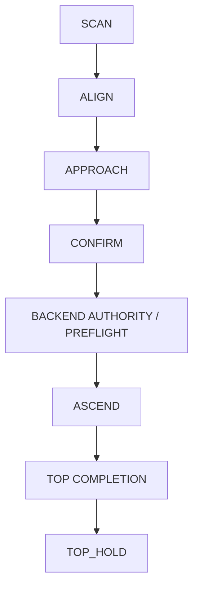

# 05. 上り・下りスキルの設計

## 1. 最初に階段を仕様化する

「10 cm 程度の4段」だけでは制御仕様として不足する。各実験階段に ID を与え、少なくとも次を実測する。

| 項目 | 記録内容 | 影響 |
|---|---|---|
| 蹴上高 | 4段それぞれ、左右端 | body/foot clearance、総高さ |
| 踏面奥行 | 各段、最小値 | gait、脚の同時配置、下降難度 |
| 幅 | 最狭部 | 横ずれ許容範囲 |
| edge | 丸み、面取り、欠け | 点群形状、接触/滑り |
| 表面 | 材質、静止/動摩擦の目安 | slip、domain randomization |
| 固定 | ブロックのずれ/たわみ | 動的 hazard |
| top landing | 奥行、幅、障害物 | 全脚停止、旋回可否 |
| bottom landing | 階段前の平面 | 接近と下端停止 |

Go2 は全長が約 0.7 m なので、上端で180°旋回させるなら、機体外形だけでなく足の sweep と edge margin を含む約 1 m 級の平坦面を初期目安とする。実測 footprint test に合格しない場合、旋回して前向き下降する計画は禁止する。

MVP の想定 envelope:

- 固体で動かないブロック。
- 蹴上 `0.10 m ± 0.01 m`。
- 4段、総高さは実測値を使用。
- 踏面と幅は Phase 0 で固定し、学習/評価の主分布に入れる。
- 乾燥した均一表面、強い逆光/鏡面/透明材なし。
- 人や物体が階段に侵入しない監視区画。

## 2. センサの役割分担

| センサ | 主用途 | 単独で任せないこと |
|---|---|---|
| L1/L2 4D LiDAR | SLAM、床/段差のメートル幾何、広い視野 | 単一 scan だけで10 cm段を確定 |
| 標準 RGB camera | 「階段らしい」領域、障害物/人、semantic ID | 単眼の見かけだけで段高や安全距離を決定 |
| optional RGB-D | 段鼻、踏面、下降 edge、局所密点群 | 欠測を平面として補完 |
| IMU/LowState | 姿勢、角速度、joint、温度、battery | 階段 completion を body height だけで決定 |
| LiDAR LIO/VIO | body velocity、局所 height progress | `ReleaseMode()` 後も当然使えると仮定 |
| foot contact | 接地と slip の補助 | Go2 X の `foot_force` を実測力と未確認のまま信頼 |

L1 の公称精度は約 ±2 cm 級で、10 cm に対して無視できない。0.5〜1.0秒の点群を LIO で自己位置補償し、複数の水平面と周期的な edge を同時に fitting する。

下降、とくに後退下降では rear/down の着地点が機体に隠れる可能性がある。360° LiDAR の仕様だけで可視性を保証せず、実機 coverage map を測る。rear footprint が不足するなら、後方斜め下向き RGB-D を追加するか、十分な上端 landing を作って前向き下降へ切り替える。

## 3. StairModel の生成

### 3.1 pipeline

```text
raw LiDAR / RGB-D / RGB / odometry
  -> timestamp・外部パラメータ検証
  -> motion compensation、0.5〜1.0 s temporal fusion
  -> dominant floor plane
  -> horizontal tread candidates + vertical/edge candidates
  -> parallelism、等間隔、幅の model fitting
  -> terrain class (STAIRS / DROP / WALL / UNKNOWN) classification
  -> stairs の場合だけ direction (UP / DOWN / UNKNOWN) estimation
  -> StairModel + covariance + visible/unknown/freshness mask
```

RGB/VLM が `stairs` と答えても、幾何 fit が不成立なら `UNKNOWN` のままである。VLM が timeout、CLI 不在、JSON 不正、例外の場合に肯定扱いする現行のfail-open経路は廃止する。VLMをrequired sensorにしたrunはNo-Goとし、既知固定階段でVLMがadvisoryなら、幾何と独立guardianの全gateを満たす場合に限りVLMなしで続行できる。

### 3.2 出力

```yaml
stair_id: test_stair_001
timestamp_monotonic_ns: 0
frame_id: odom
terrain_class: STAIRS    # STAIRS | DROP | WALL | UNKNOWN
direction: UP            # UP | DOWN | UNKNOWN。terrain_class=STAIRS のときだけ有効
pose: [x, y, z, yaw]
width_m: 0.0
riser_height_m: [0.10, 0.10, 0.10, 0.10]
tread_depth_m: [0.0, 0.0, 0.0, 0.0]
bottom_plane: {normal: [], offset: 0.0, covariance: []}
top_plane: {normal: [], offset: 0.0, covariance: []}
visible_steps: 4
fresh_coverage:
  approach: 0.0
  next_footholds: 0.0
  landing: 0.0
training_envelope_match: false
confidence: 0.0
```

`confidence` 一つに安全判断を隠さず、terrain class、direction、geometry、freshness、coverage、covariance を別 field として残す。`DROP` は階段方向の一種ではなく、乗り入れを拒否する地形 class である。

### 3.3 unknown の扱い

現行 elevation map の「未観測 cell を平地高さで埋める」動作は、policy shape を満たすには便利でも、安全 gate には使えない。次の二層を分離する。

- `policy_height_scan`: 既存235次元観測との互換のため、明示した imputation と mask/history から生成。
- `safety_terrain_map`: unknown、age、variance を保持し、foot/landing region の未観測を NO-GO にする。

既存 Wave5 の187点 pattern は body周囲 `x=-0.8..0.8 m`, `y=-0.5..0.5 m`, 0.1 m間隔であり、理論上は前後を含む。ただし下降時に後半が実センサで埋まっているか、学習時に負方向移動と inverted stairs で利用されたかを別々に検証する。

## 4. 接近と整列

階段を通常の障害物と同じ costmap に入れると、planner が近づけないか、逆に登れる面と誤認する。二段階に分ける。

1. **Staging navigation**: stair base から 0.5〜0.8 m の semantic approach pose まで平地 navigation。
2. **Precision alignment**: StairModel を body frame で更新しながら、0.35〜0.50 m の最終位置まで低速移動。

`AT_BASE_HOLD` の初期 gate:

- stair direction が `UP`。
- 段高、踏面、幅、段数が許可 envelope 内。
- yaw error ≤ 3°、lateral error ≤ 5 cm。
- base-to-first-edge distance が policy/純正歩容の開始範囲内。
- approach、次の足置き、少なくとも見えている landing の fresh coverage ≥ 90%。
- body roll/pitch、水平/鉛直速度が開始閾値内で1秒安定。
- 人/動的物体なし、battery/temperature/network正常。

距離値は policy の実測成功分布から確定し、コード中の暗黙定数にしない。

## 5. 上り skill



### 5.1 preflight

1. 最新 `StairModel` と stair ID を lock する。
2. geometry が学習/純正 gait envelope 内か確認する。
3. Sport `StopMove` 後、静止、姿勢、owner lease を確認する。
4. 実測worst-caseの上り＋設定最大TOP_HOLD＋下降/回収energyにreserveを加え、thermal余裕とtimeout recoveryがrun manifestにあることを確認する。
5. **Branch L**: Motion serviceを正式手順でreleaseし、必要topicの生存とLowCmd exclusive authorityを再確認する。現在joint poseからpolicy nominal poseへ0.3〜0.5秒のbounded ramp-inを行い、policy output、NaN、joint/velocity/torque/rate limit、publish deadlineを検査する。
6. **Branch S**: formal stair APIの対象方向、ready state、exclusive Sport authority、request/ack/timeout、`StopMove`、remote override、terminal stand契約を確認する。通常の`Move()`を階段skillとして代用しない。

### 5.2 実行

純正歩容 branch と policy branch は、同じ `ASCEND` 状態と progress/completion API を使う。policy branch は固定時間の open-loop ではなく、局所目標、StairModel、progress に応じた bounded velocity hint を使う。

監視する値:

- body roll/pitch と angular rate。
- joint error/rate/estimated torque、motor temperature。
- LIO height progress と stair axis progress。
- foot/edge proximity、body/shank collision proxy、slip proxy。
- perception age/coverage。Branch Lはpolicy inference age/LowCmd deadline、Branch SはSport request/ack/state ageとAPI timeout/remote overrideを監視する。
- expected progress に対する stall。

途中で stair geometry を頻繁に再fitして targetを飛ばさず、locked model と更新モデルの差が閾値を超えたら speedを落として recovery/hold を判断する。

## 6. 上端完了判定

`base_z` が約40 cm上がっただけでは不十分である。次の独立した証拠をすべて要求する。

### 6.1 幾何・進捗

- `sum(riser_height)` と整合する高度差。
- stair axis 上で last edge を通過。
- 前方に次の riser がない。
- top plane が十分な面積で観測され、fresh/low variance。

### 6.2 足と footprint

- forward kinematics と接触推定で、4足の接地点が top plane 上。
- rear feet も last edge から安全 margin を越えている。
- body/全足 footprint が top landing の support polygon 内。
- 接触力が信頼できない SKU では、joint/IMU/足速度/LIOを組み合わせ、単一の `foot_force` に依存しない。

### 6.3 動力学的安定

- command はゼロ。
- 水平速度、鉛直速度、roll/pitch rate が閾値以下。
- 姿勢と足接地が0.8〜1.5秒連続で安定。
- safety limit違反、stall、未知領域なし。

判定後は選択backendのactive-balance authorityを終了せず`TOP_HOLD`に移る。下降が次の命令なので、階段上で無用なbackend/mode switchをしない。

## 7. 下降方式の選択

下降は上昇 policy の逆再生ではない。足が空中へ出る前に下側踏面を予測する必要があり、edge miss は転倒へ直結する。

### 7.1 後退下降: MVP 第一候補

上昇時の向きを保ち、rear feetから階段へ戻る。

利点:

- 上端で180°旋回しない。
- Unitree の旧 Go2 manual にも前進上り・後退下りの階段モードが記載されている。
- 狭い top landing でも成立しやすい。

課題:

- rear/down landing と edge の可視性。
- operator camera view と進行方向が逆。
- 負の速度を含む policy学習・評価。
- rear feet first の completion/progress と emergency hold。

採用条件:

- rear half の height scan と次の2足 placement region が実測で十分見える。
- Branch Lはsensor occlusion/dropoutを含む下降専用sim2simと実機ladder、Branch Sはvendor適用条件＋formal backward-stair API＋実機ladderに合格。
- Branch Lは`DESCEND_BACKWARD`と`HOLD`を明示学習・検証し、Branch Sはbackward descentとterminal balanceをformal API stateとして確認する。

### 7.2 旋回後の前向き下降

top landing で安全に180°旋回し、階段を再取得して前向きに下る。

採用条件:

- landing に機体・脚 sweep・edge marginを含む平面がある。
- turn path全域が観測済みで平坦。
- 旋回後に stair ID、方向、段数、edge poseを再取得する。
- 前向き下降 policy/純正 gaitを独立に評価する。

旋回スペース不足を controller の器用さで補わない。試験階段を拡張する方が安全で速い。

### 7.3 方式決定表

| 条件 | 選択 |
|---|---|
| top landing が狭い、rear/down coverage 良好 | 後退下降 |
| top landing が十分、front/down coverage 良好 | 両方式を評価し成功率で選択 |
| rear/downもfront/downも landing不明 | 下降拒否、センサ/階段を変更 |
| stair geometry が学習 envelope外 | 下降拒否 |

## 8. 下降 preflight と実行

上端に到達した時点の `StairModel` をそのまま信用しない。選択した音声入力（AirPods／有線マイク）から下降命令を受けた後に再観測する。

1. `TOP_HOLD` と robot/stair ID の連続性を確認する。
2. chosen direction に対する sensor view を取得する。
3. 下降 edge、各 tread、bottom plane、unknown maskを再fitする。
4. first rear/front feet と edge の相対位置を確認する。
5. geometryが学習policyまたは純正gaitの検証envelope内、bottom landing fresh、侵入物なしを確認する。
6. Branch Lはexclusive LowCmd authorityとpolicy readiness、Branch Sはexclusive Sport authorityとformal stair API ready/ack/timeoutを確認し、`DESCENT_PREFLIGHT`から選択backendを起動する。

下降中は、base heightの単調減少だけを目標にしない。足先 clearance、edge contact、局所goal progress、body pitch、slipを監視する。知覚が一時途絶した場合の proprioceptive fallback は、学習・試験で定めた短い時間窓に限定し、未知のまま次段へ進み続けない。

## 9. 下端完了判定

次をすべて要求する。

- bottom plane に整合する総下降高。
- 全4足が bottom plane 上。
- front/rearの最後の足が最終edgeを越え、階段から規定 margin離れた。
- body footprintが bottom landing内。
- 後方/前方に未通過riserがない。
- command zero、水平/鉛直速度と姿勢rateが閾値以下。
- fresh coverageを保ったまま0.8〜1.5秒安定。

成立後は `BOTTOM_HOLD`。十分広く平坦な領域が確認できた場合だけ、`CONTROLLED_EXIT` で Sport serviceへ戻す。

## 10. STOP と回復

通常の完了停止は landingを目標にした計画的な停止である。階段途中の `STOP_NOW` は関節を瞬時にfreezeする意味ではなく、検証済みの最大減速度で commandをゼロへ寄せ、最初の安定stanceでactive holdする。Branch Lはこれを上り/下りの全gait phaseで学習・fault injectionし、Branch Sはformal停止契約と全phaseの実機fault injectionで同じ外部結果を実証しなければならない。

| 状況 | 原則動作 |
|---|---|
| 命令キャンセル、recoverable sensor遅延 | 減速して active hold。再開には再検証 |
| geometryが開始前に不一致 | skillを起動せず hold |
| 短時間の perception dropout | 検証済み時間だけ proprioceptive fallback、速度低下 |
| 長い dropout/stall | 安定stanceへ hold。blind reverseをしない |
| slip/姿勢閾値接近 | policy recoveryまたは検証済み保護動作 |
| NaN、owner競合、姿勢破綻、LowState喪失 | Safety Supervisorのcritical path。索/監視者を前提にDamp等を実行 |

階段途中で Damp すると転落する場合があり、active holdしても既に支持多角形が破綻している場合がある。faultごとの最安全動作は吊り下げ・低段の実測から `fault_policy.yaml` に固定する。

## 11. 評価を分ける

次を別々の指標として報告する。

- stair detection / geometry。
- staging navigation / alignment。
- 上り locomotion。
- top completion / hold。
- 下降 preflight。
- 後退下降。
- 前向き下降。
- bottom completion / hold。
- `STOP_NOW` と各fault recovery。
- 全Mission。

フルMissionの失敗だけを数えると、音声、知覚、接近、歩容、完了判定のどこを直すべきか分からない。各runは最初の失敗層とreason codeを一つ以上持たせる。

## 12. 参考にする公式情報

- [Unitree Go2 product/specification](https://www.unitree.com/go2/)
- [Unitree 4D LiDAR L1 manual](https://oss-global-cdn.unitree.com/static/52b72f707b304d229d4321eea223738f.pdf)
- [Unitree SDK2](https://github.com/unitreerobotics/unitree_sdk2)
- [Go2 user manual mirror](https://fcc.report/FCC-ID/2A5PEYUSHU004/7349920.pdf)

公称段差能力やmanualの階段modeは、4段連続の自律昇降性能やSDK呼び出し可否の保証ではない。serial/firmwareごとのPhase 0実測を優先する。
