# Mermaid 図解

設計文書内の Mermaid を、閲覧しやすい SVG と PNG にレンダリングしたものです。`.mmd` が編集元で、SVG は拡大閲覧用、PNG はプレビューや資料貼り付け用です。

| 図 | 元文書 | SVG | PNG | Mermaid source |
|---|---|---|---|---|
| システム全体アーキテクチャ | `02_TARGET_ARCHITECTURE.md` / 「システム全体」 | [SVG](system-architecture.svg) | [PNG](system-architecture.png) | [MMD](system-architecture.mmd) |
| Mission state machine（可読版） | `02_TARGET_ARCHITECTURE.md` / 「Mission state machine」 | [SVG](mission-state-machine.svg) | [PNG](mission-state-machine.png) | [MMD](mission-state-machine.mmd) |
| Mission state machine（全遷移・原文準拠） | `02_TARGET_ARCHITECTURE.md` / 「Mission state machine」 | [SVG](mission-state-machine-full.svg) | [PNG](mission-state-machine-full.png) | [MMD](mission-state-machine-full.mmd) |
| 実装ロードマップ分岐 | `04_ROADMAP.md` / 「全体方針」 | [SVG](implementation-roadmap.svg) | [PNG](implementation-roadmap.png) | [MMD](implementation-roadmap.mmd) |
| 上り skill flow | `05_ASCENT_DESCENT_DESIGN.md` / 「上り skill」 | [SVG](ascent-skill-flow.svg) | [PNG](ascent-skill-flow.png) | [MMD](ascent-skill-flow.mmd) |

## プレビュー

### システム全体アーキテクチャ

[](system-architecture.svg)

### Mission state machine（可読版）

[](mission-state-machine.svg)

重要な通常経路、回復可能停止、頂上待機 timeout、critical stop を分けて配置した説明用の図です。全遷移を一対一で確認する場合は、次の原文準拠版を参照してください。

### Mission state machine（全遷移・原文準拠）

[](mission-state-machine-full.svg)

### 実装ロードマップ分岐

[](implementation-roadmap.svg)

### 上り skill flow

[](ascent-skill-flow.svg)

## 再生成

Mermaid CLI `11.12.0` を固定してあります。

```bash
./docs/mermaid/render.sh
```

元文書の Mermaid を変更した場合は、対応する `.mmd` も同時に更新してから再生成してください。
